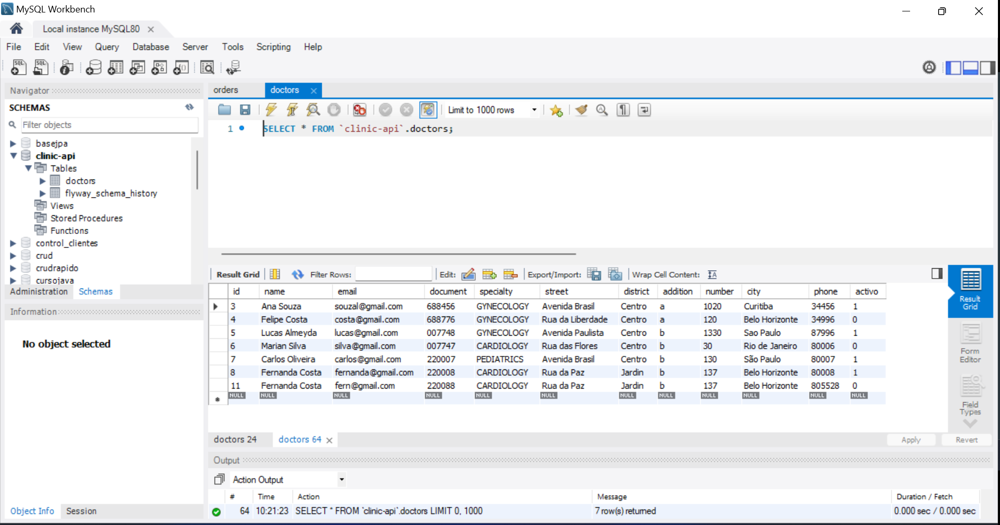
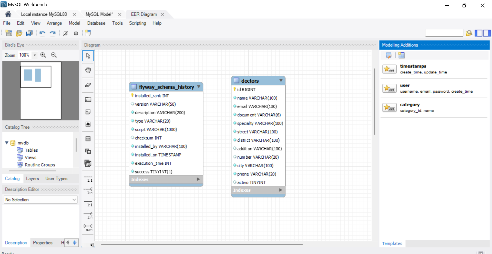
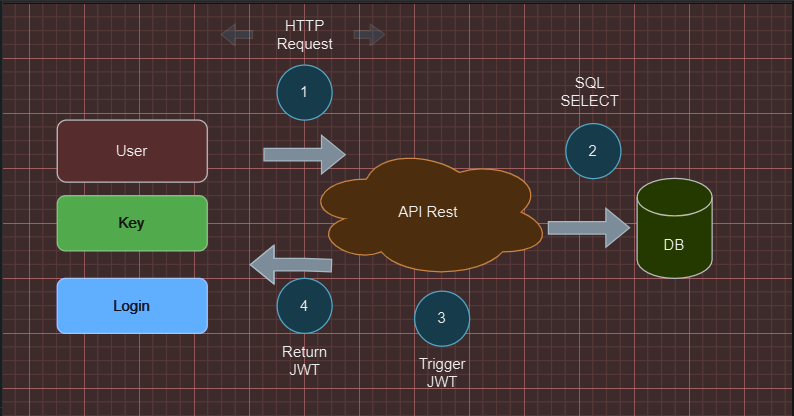
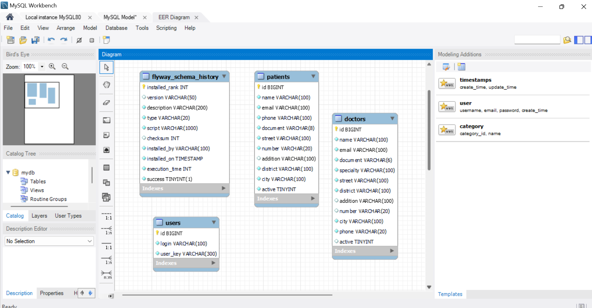
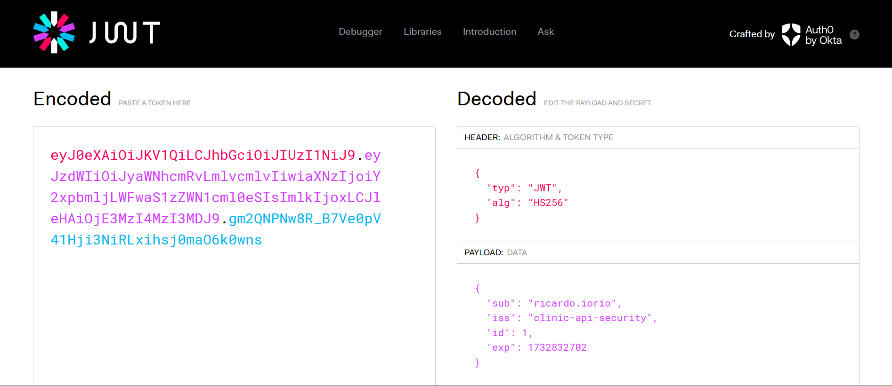
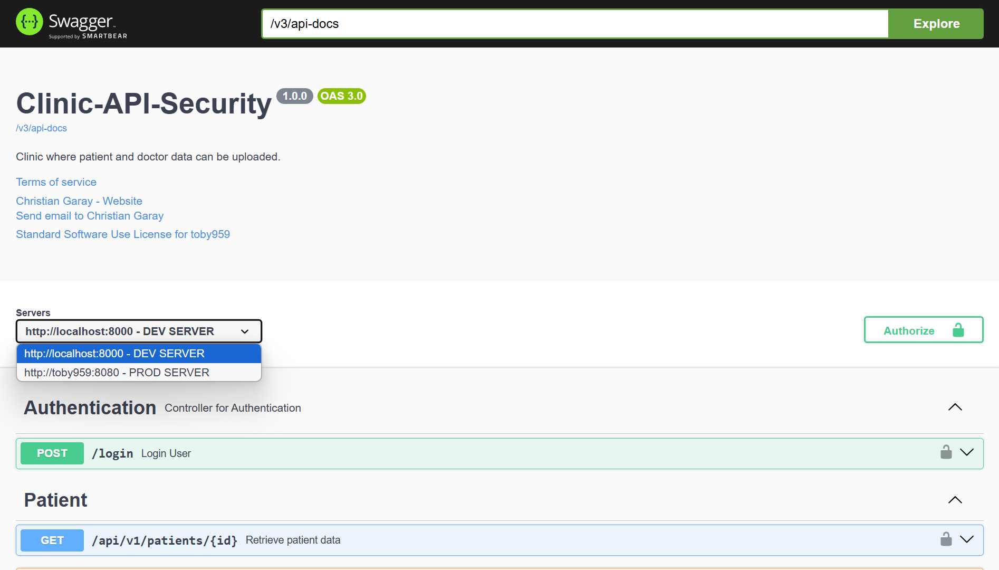
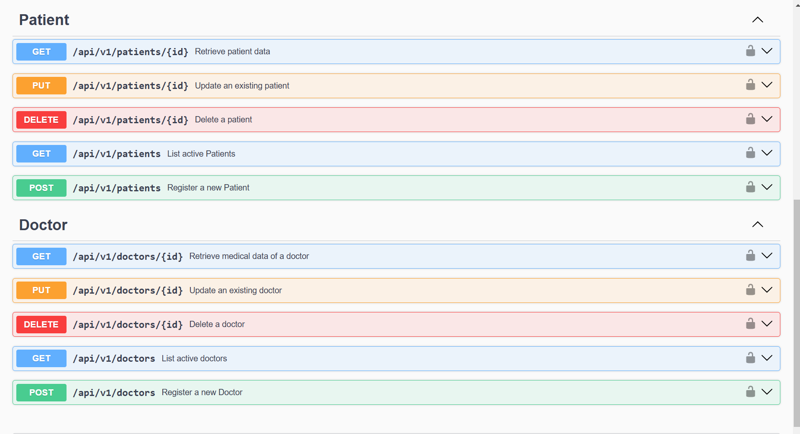
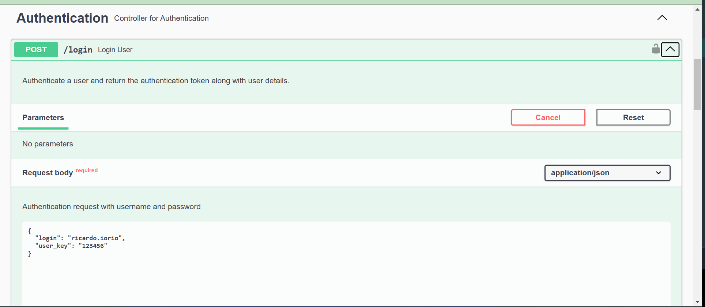
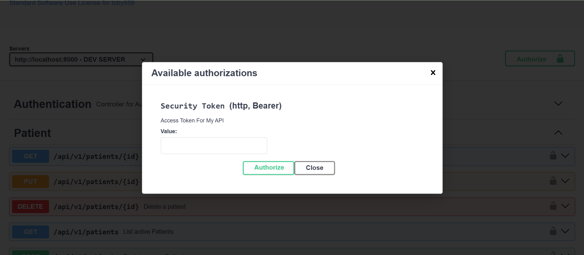

 <h1 style="text-align: center;"> Api Clinic-security 🏥</h1>


# Descripción 📖
El desarrollo de una API rest para una clínica permite registrar los datos de sus médicos: nombre, email, teléfono, documento, estado (activo/inactivo), especialidad y dirección, que contiene: calle, distrito, ciudad, número y complemento (categoría). Se realizó un borrado lógico para evitar perder datos en la base de datos, utilizando MySQL Workbench.
___ 

# Recursos 👾

| Plugin           | URL                      |
|------------------|--------------------------|
| spring-boot-starter-web | https://start.spring.io/ |
| spring-boot-devtools    | https://start.spring.io/ |
| lombok | https://start.spring.io/ |
| spring-boot-starter-data-jpa | https://start.spring.io/ |
| flyway-core | https://start.spring.io/ |
| flyway-mysql | https://start.spring.io/ |
| mysql-connector-j | https://start.spring.io/ |
| spring-boot-starter-validation | https://start.spring.io/ |
| spring-boot-starter-security | https://start.spring.io/ |
| java-jwt | https://start.spring.io/ |
| springdoc-openapi-starter-webmvc-ui | https://springdoc.org/#getting-started |
___
# Herramientas utilizadas 🛠️


&nbsp;
&nbsp;
&nbsp;
&nbsp;
&nbsp;
&nbsp;

&nbsp;&nbsp;&nbsp;&nbsp;&nbsp;&nbsp;&nbsp;&nbsp;&nbsp;[](LICENSE)&nbsp;&nbsp;&nbsp;&nbsp;&nbsp;&nbsp;&nbsp;&nbsp;&nbsp;
___


# Ejecutar el Proyecto ⚙️
1 - Clona el repositorio en tu máquina local
``` bash
git clone
<https://github.com/toby959/toby959-clinic.git>
```
2 - Compila y ejecuta el archivo ApiApplication.java.
___

# Funcionalidades 📦

Esta API REST permite cargar los datos de los médicos y pacientes, evitando la duplicación de información. Se pueden guardar los datos de los médicos y pacientes que se eliminan debido a un borrado lógico, que cambia el estado de 'activo' (1) a 'desactivo' (0). Además, se emplea Flyway, una herramienta de migración de bases de datos que facilita la gestión de cambios en la estructura de la base de datos a lo largo del tiempo.   
### Beneficios
Simplicidad: Facilita el manejo de migraciones sin necesidad de realizar cambios manuales en la base de datos.   
Trazabilidad: Ofrece un registro claro y accesible sobre el estado actual y el historial de las migraciones aplicadas.   
Integración: Se integra fácilmente con herramientas como Maven y Gradle, así como con frameworks como Spring Boot.   
___
## Uso de Postman
* Base de datos: `clinic-api-security`   
#### Flexibilidad: Al usar una variable como {{url}}, puedes cambiar la URL base en un solo lugar (en la configuración del entorno) y todas las solicitudes que utilicen esa variable se actualizarán automáticamente. Esto es especialmente útil cuando trabajas con diferentes entornos (desarrollo, pruebas, producción) donde la URL puede variar.   

## Métodos: 
### POST 
- **Descripción**: Este método se utiliza para crear nuevos registros de médicos en la base de datos.
- **Endpoint**: `{{url}}/api/v1/doctors`
- **Cuerpo de la solicitud**:

````bash
{
    "name": "Fernanda Costa",
    "email": "fern@gmail.com",
    "phone": "805528",
    "document": "220088",
    "specialty": " CARDIOLOGY",
    "address": {
       "street": "Rua da Paz",
        "district": "Jardin",
        "city": "Belo Horizonte",
        "number": "137",
        "addition": "b"
    }
````
### GET
- **Descripción**: Este método trae una lista de médicos, según el uso de 'Page' usado para la paginación de los datos de DB, en este caso `@PageableDefault(size = 2)`.
- **Endpoint**: `{{url}}/api/v1/doctors`
- **Cuerpo de la solicitud**: vacío. 

### PUT
- **Descripción**: Este método permite modificar, nombre; documento y email del médico.
- **Endpoint**: `{{url}}/api/v1/doctors/5`
- **Cuerpo de la solicitud**:
````bash
{
    "id": 5,
    "name": "Lucas Almeyda",
    "document": "007748",
    "email": "lucas@gmail.com"
}
````

### DEL
- **Descripción**: Este método permite el borrado lógico del médico.
- **Endpoint**: `{{url}}/api/v1/doctors/3`
- **Cuerpo de la solicitud**: vacío.

### POST
- **Descripción**: Este método se utiliza para crear nuevos registros de pacientes en la base de datos.
- **Endpoint**: `{{url}}/api/v1/patients`
- **Cuerpo de la solicitud**: 
````bash
{
    "name": "Maria G",
    "email": "mar@gmail.com",
    "phone": "4512",
    "document": "34345339",
    "address": {
        "addition": "quebradura expuesta",
       "street": "Avenida Libertad",
        "district": "Norte",
        "city": "Cartago",
        "number": "5321"        
    },
    "active":1
}
````
### GET
- **Descripción**: Este método trae una lista de pacientes, según el uso de 'Page' usado para la paginación de los datos de DB, en este caso `@PageableDefault(size = 10, sort = {"name"})`. Esto especifica que, por defecto, se devolverán hasta 10 elementos por página. Si no se proporciona un parámetro de paginación en la solicitud (por ejemplo, si el cliente no especifica cuántos elementos quiere por página), se utilizará este valor predeterminado `sort = {"name"}` este parámetro indica que los resultados se ordenarán por el campo name. En este caso, los pacientes serán listados en orden ascendente según su nombre. Si el cliente no proporciona un criterio de ordenamiento en la solicitud, se aplicará este orden predeterminado.    
- **Endpoint**: `{{url}}/api/v1/patients`
- **Cuerpo de la solicitud**: vacío.

### PUT
- **Descripción**: Este método permite modificar, nombre; teléfono y domicilio del paciente.
- **Endpoint**: `{{url}}/api/v1/patients/1`
- **Cuerpo de la solicitud**:
````bash
{
    "id": 1,
    "name": "Carla Peterson",
    "phone": "332244",
    "address": {
        "addition": "presion alta",
        "street": "Avenida Colombia",
        "district": "Sur",
        "city": "San Fernando de Catamarca",
        "number": "101"
    }
}
````
### DEL
- **Descripción**: Este método permite el borrado lógico del médico.
- **Endpoint**: `{{url}}/api/v1/patients/3`
- **Cuerpo de la solicitud**: vacío.
___ 

# Colaboraciones 🎯
Si deseas contribuir a este proyecto, por favor sigue estos pasos:

1 - Haz un fork del repositorio: Crea una copia del repositorio en tu cuenta de GitHub.  
2 - Crea una nueva rama: Utiliza el siguiente comando para crear y cambiar a una nueva rama:
```bash
git chechout -b feature-nueva
```
3 - Realiza tus cambios: Implementa las mejoras o funcionalidades que deseas agregar.  
4 - Haz un commit de tus cambios: Guarda tus cambios con un mensaje descriptivo:
```bash 
git commit -m 'Añadir nueva funcionalidad'
```
5 - Envía tus cambios: Sube tu rama al repositorio remoto:
````bash
git push origin feature-nueva
````
6 - Abre un pull request: Dirígete a la página del repositorio original y crea un pull request para que revisemos tus cambios.

💥Gracias por tu interés en contribuir a este proyecto. ¡Esperamos tus aportes!
___
# Imagenes:

















## Desglose del Payload    
### sub: "ricardo.iorio"    
Este es el "subject" (sujeto) del token, que generalmente representa al usuario o entidad a la que se refiere el token. En este caso, indica que el sujeto es "ricardo.iorio".    
### iss: "clinic-api-security"    
Este campo indica el "issuer" (emisor) del token, que es la entidad que ha generado y firmado el token. En este caso, se trata de "clinic-api-security".    
### id: 1    
Este es un campo personalizado que representa un identificador único para el usuario o entidad en la base de datos. Aquí, el valor 1 corresponde al ID del usuario "ricardo.iorio".    
### exp: 1732832702    
Este es el campo de "expiration" (expiración), que indica cuándo expira el token. El valor está en formato de tiempo Unix (timestamp), que representa la cantidad de segundos desde el 1 de enero de 1970 (UTC).    


___   
## Swagger

````
localhost:8000/swagger-ui.html
````

### Instrucciones para Autenticación

1. **Genera la Clave**: Utiliza el script proporcionado a continuación para generar la clave.    
````
{
  "login": "ricardo.iorio",
  "user_key": "123456"
}
```` 



2. **Copia el Token**: Una vez que hayas generado la clave, copia el token resultante.
3. **Autoriza el Acceso**:
    - Haz clic en el botón **'Authorize'** en la interfaz de Swagger.
    - Pega el token copiado en el campo correspondiente.
    - Presiona nuevamente el botón **'Authorize'** para confirmar.
    - Finalmente, haz clic en el botón **'Close'** para cerrar la ventana de autorización.

Con estos pasos, podrás acceder a todos los endpoints de la API.


___

## Retos 💡
#### * Postman: exportación de colecciones, puedes exportar tus datos, que incluyen colecciones, entornos y variables globales, en formato JSON. Esto te permite compartir tus configuraciones y pruebas con otros o reutilizarlas en diferentes instancias de Postman.    
#### * Flyway: aprender a setear la tabla de la DB.    
````
SET SQL_SAFE_UPDATES = 0;
````
````
DELETE FROM flyway_schema_history WHERE version = 'la que deseas borrar o la que te da error!!!';
````
#### * MySQL Workbench: a no usar las palabras reservadas como 'key' debiendo usar en su lugar "user_key".    

#### * En la clase 'TokenService': no es necesario usar un constructor para la variable de entorno "private String apiSecret;".  La anotación @Value de Spring se encarga de inyectar el valor de la propiedad configurada en el archivo de propiedades (por ejemplo, application.properties).    

#### * Modificar el método "securityFilterChain" de la clase "SecurityConfigurations". Por ejemplo, supongamos que en nuestra aplicación existe un perfil de acceso denominado ADMIN, y que solo los usuarios con este perfil tienen permiso para eliminar médicos y pacientes.    
#### * El método @Secured("ROLE_ADMIN"), de modo que sólo los usuarios con el rol ADMIN pueden activar solicitudes para detallar a un médico. La anotación @Secured se puede agregar en métodos individuales o incluso en la clase, lo que sería el equivalente a agregarla en todos los métodos.
## ⚠️Se debe agregar la siguiente anotación en nuestra clase 'SecurityConfigurations', ya que por defecto esta desabilitado:    

````bash
@EnableMethodSecurity(securedEnabled = true)
````

#### * Swagger: Leer la documentacion [Visita Swagger](https://springdoc.org/) 
___

## Licencia 📜

#### Este proyecto está licenciado bajo la Licencia MIT - ver el archivo [LICENSE](https://github.com/toby959/toby959-clinic/blob/main/LICENSE) para más detalles.

